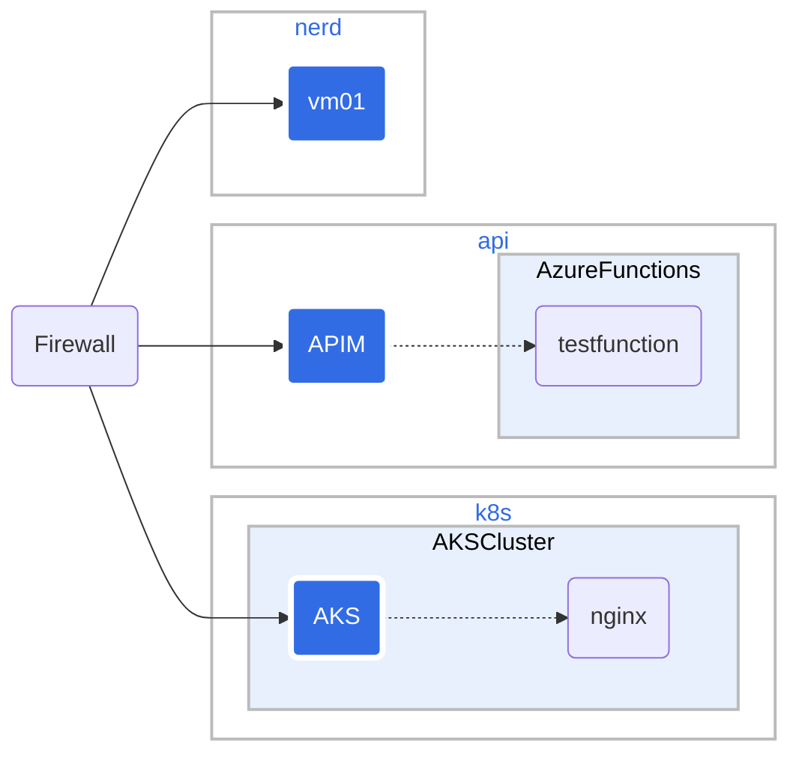

# NerdMeet

## Latest news

* NerdNet playground is up and running. Read more about it [here](nerdnet/readme.md).
* NerdMeet #3 yesterday.
* We started discussing how to create a hackathon event in October 2024.

## NerdMeet community

NerdMeet is a community for nerds that use technology to help people in need. At the same time we meet, share and learn new technologies.

Slogan: Helping the helpers.

The community is built on the following principles:

* We belive that technology can help people in need.
* We want to help the people and organisations that help people in need.
* We are eager to share what we know.
* We want to learn from others in the community.
* We are not selling anything to each other.
* We meet once a month after work hours.
* We are open to everyone that wants to help people in need.
* We do it for fun and to learn new things.

## NerdMeet innovation and hackathon events

We are planning to invite all who belive that technology can help people in need to a hackathon event. The event will be a full weekend and follow the [Startup Weekend](https://startupweekend.org/) format. StartupWeekend is a well tried format for innovation and hackathon events and has been runing in 150+ countries since 2007.

The event will be held in Oslo, Norway. October 2024.

## NerdMeet meetups

| Date | Time | Place | Topic |
|------|------|-------|-------|
| 2024-03-20 | 16:00 - 18:00 | Red Cross | [AI playground](meetups/nerdmeet-meetup-3.md) |
| 2024-02-14 | 16:00 - 18:00 | Red Cross | [The case from Besim where he used weather data to predict the likelihood that the Red Cross should increase readiness in areas with bad weather.](meetups/nerdmeet-meetup-2.md) |
| 2024-01-17 | 16:00 - 18:00 | Red Cross | [First meetup](meetups/nerdmeet-meetup-1.md) |

## NerdNet playgorund

We have a playground where we can test new technologies. The playground is called NerdNet. Read about it [here](nerdnet/readme.md).

nerdnet is our playground for testing new technologies. nerdnet is running on a sponsored Azure subscription.

We are looking for funding to keep the subscription running.

Playgroud setup:
| Landing Zone | Long name | Description |
|--------------|------------|-------------|
| api          | api        | For testing API managemet and Azure Functions |
| nerd     | nerdmeet       | Different VMs. for running AI and other fun stuff |
| k8s   | kubernetes        | Kubernetes cluster for testing |

If you want to create your own playground. You can just fork this repo and then you just follow the documentation to set it up.
Your testing an playing will for sure create new knowledege - please share it with the community.

Read the [readme.md](nerdnet/readme.md) for more information about the network and the resources.
