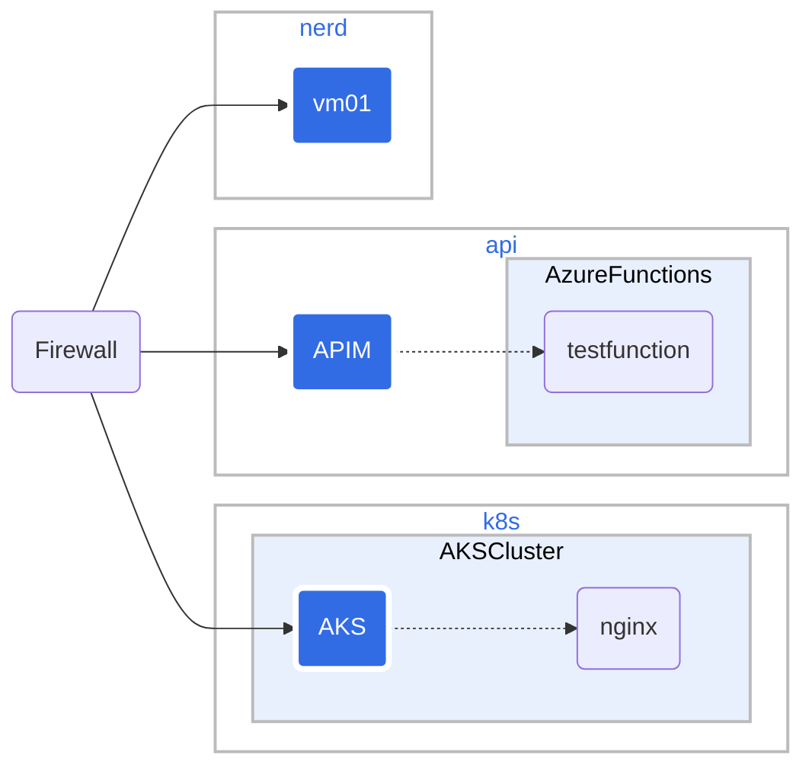

# NerdMeet
We help the helpers.
NerdMeet is a community for nerds that use technology to help people in need. At the same time we meet, share and learn new technologies.

The community is built on the following principles:

* We belive that technology can help people in need.
* We are eager to share what we know.
* We want to learn from others in the community.
* We are not selling anything to each other.
* We meet one a month after work hours.

## NerdNet playgorund

nerdnet is our playground for testing new technologies. nerdnet is running on a sponsored Azure subscription.

We are looking for funding to keep the subscription running.

Playgroud setup:
| Landing Zone | Long name | Description |
|--------------|------------|-------------|
| api          | api        | For testing API managemet and Azure Functions |
| nerd     | nerdmeet       | Different VMs. for running AI and other fun stuff |
| k8s   | kubernetes        | Kubernetes cluster for testing |

If you want to create your own playground. You can just fork this repo and then you just follow the documentation to set it up.
Your testing an playing will for sure create new knowledege - please share it with the community.

Read the [readme.md](nerdnet/readme.md) for more information about the network and the resources.
