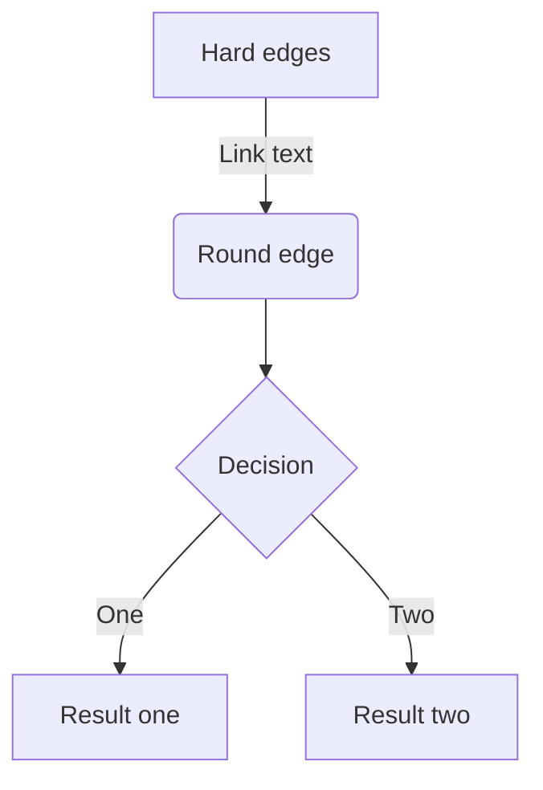
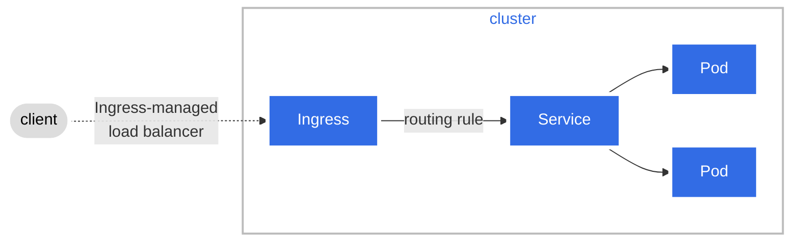

# howto make diagrams 

We use [mermaid](https://mermaid-js.github.io/mermaid/#/) to make diagrams.
The diagrams are defined in markdown files and rendered by the mermaid plugin in the markdown editor. This makes it possible to define diagrams in the same file as the text that describes the diagram. We follow the guide defined by [Diagram Guide by kubernetes community](https://kubernetes.io/docs/contribute/style/diagram-guide/).

* Why use mermaid? Because it is easy to use and it is rendered in the markdown editor.
* Why use mermaid? Because documentation and diagrams are in the same file. And they are versioned together (git).
* Why not use draw.io? Because it is not rendered in the markdown editor and you need to use a separate program to maintain the diagram.
* Why not use powerpoint? Because it is not rendered in the markdown editor and you need to use a separate program to maintain the diagram.

KISS - Keep It Simple Stupid.
Keep the diagrams simple. Use the same style for all diagrams.
Use the mermaid live editor to create the diagrams. It is easier to create the diagrams in the live editor and then copy the code to the markdown file.
You find the mermaid live editor at [mermaid live editor](https://mermaid.live). You can [find the full documentation here](https://mermaid.js.org/intro/). If you use vscode as your editor you can view the diagrams in the preview mode.

If you want to dep dive and see how it compares to other tools [read the mermaid.js: A Complete Guide](https://swimm.io/learn/mermaid-js/mermaid-js-a-complete-guide)

## Example 1



## Example 2



```mermaid
graph LR;
 client([client])-. web or API <br> request .->ingress[Firewall];
 ingress-->|routing rule|service[dispatcher?];
 subgraph Firewall functionality
 ingress;
 service-->pod1[Network segment];
 service-->pod2[network segment];
 service-->pod3[Network segment];
 end
 classDef plain fill:#ddd,stroke:#fff,stroke-width:4px,color:#000;
 classDef k8s fill:#326ce5,stroke:#fff,stroke-width:4px,color:#fff;
 classDef cluster fill:#fff,stroke:#bbb,stroke-width:2px,color:#326ce5;
 class ingress,service,pod1,pod2,pod3 k8s;
 class client plain;
 class cluster cluster;
 ```
 