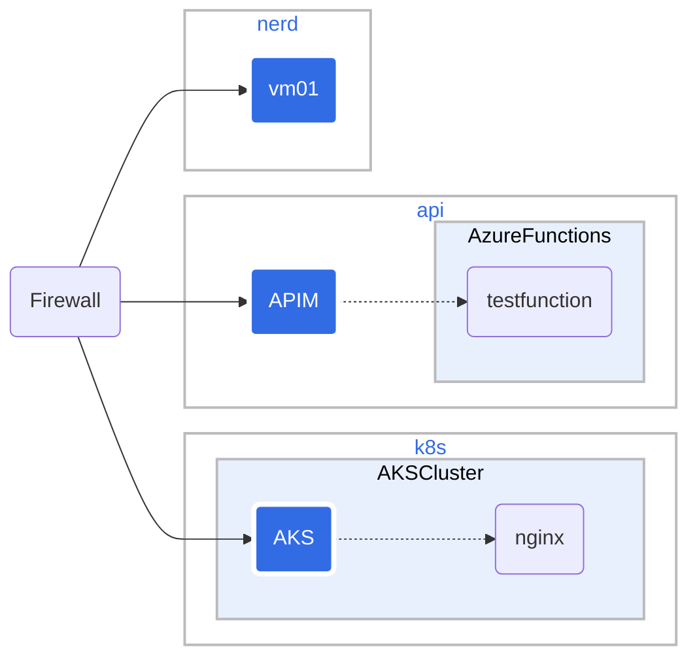

# nerdnet network

In front of all landing zones there is an Application Gateway. The Application Gateway terminates SSL and routes traffic based on subdomain. The Application Gateway is the only resource with a public IP address.

## Landing Zones

The landing zones are:

| Landing Zone | Long name | Description |
|--------------|------------|-------------|
| api          | api        | Azure API Management and Azure Functions |
| nerd     | nerdmeet       | AI and different VMs |
| k8s   | kubernetes        | Kubernetes cluster |

Documentation on how to set up the landing zones can be found in the [Application Gateway](14cmd-application-gateway.md) folder.

## Network info

### VNET

| Virtual Network | Address Space |
|-----------------|---------------|
| vnet-eus        | 10.21.0.0/16  |

### Subnets

| Subnet | Address Space | Comment |
|--------|---------------|---------|
| appgw-backend-sn01-eus | 10.21.0.0/24 | Application Gateway |
| nerd-backend-sn01-eus | 10.21.1.0/24 | nerd (nerdmeet)  |
| k8s-backend-sn01-eus | 10.21.2.0/24 | k8s (kubernetes) |
| api-backend-sn01-eus | 10.21.3.0/24 | api (Azure API Management and Azure Functions) |

Doc on how set up the landing zones can be found in [Network Landing Zones](13cmd-network-landingzones.md).

This is the current description of the nerdnet network. For a conseptual overview of the network see [7concept-network-architecture-security.md](7concept-network-architecture-security.md).

## Firewall documentation

Firewall documentation can be found in [nerdnet-firewall](10nerdnet-firewall.md).
