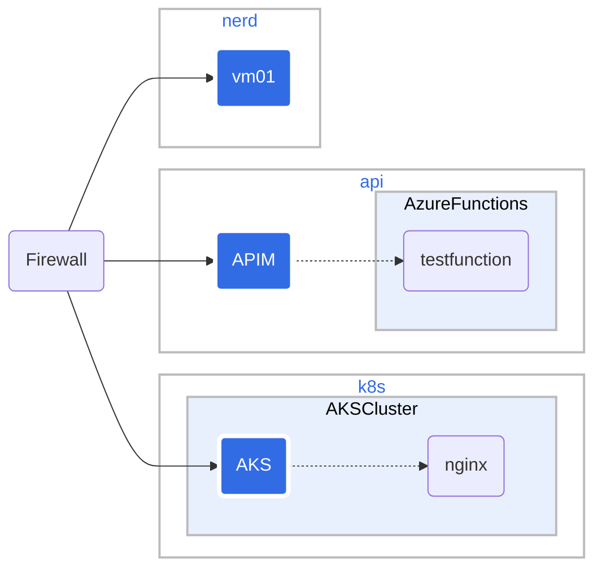

# nerdnet network

This is the current description of the nerdnet network. For a conseptual overview of the network see [7concept-network-architecture-security.md](7concept-network-architecture-security.md).


## Landing Zones




## The Zones

```mermaid
graph LR;
 client([client])-. web or API <br> request .->ingress[Azure Application Gateway];
 ingress-->|routing rule|service[dispatcher?];
 subgraph Firewall functionality
 ingress;
 service-->pod1[Landing zone 1];
 service-->pod2[Landing zone 2];
 service-->pod3[Landing zone 3];
 end
 classDef plain fill:#ddd,stroke:#fff,stroke-width:4px,color:#000;
 classDef k8s fill:#326ce5,stroke:#fff,stroke-width:4px,color:#fff;
 classDef cluster fill:#fff,stroke:#bbb,stroke-width:2px,color:#326ce5;
 class ingress,service,pod1,pod2,pod3 k8s;
 class client plain;
 class cluster cluster;
 ```

Using CAF terminology we can define the network architecture in terms of landing zones.

