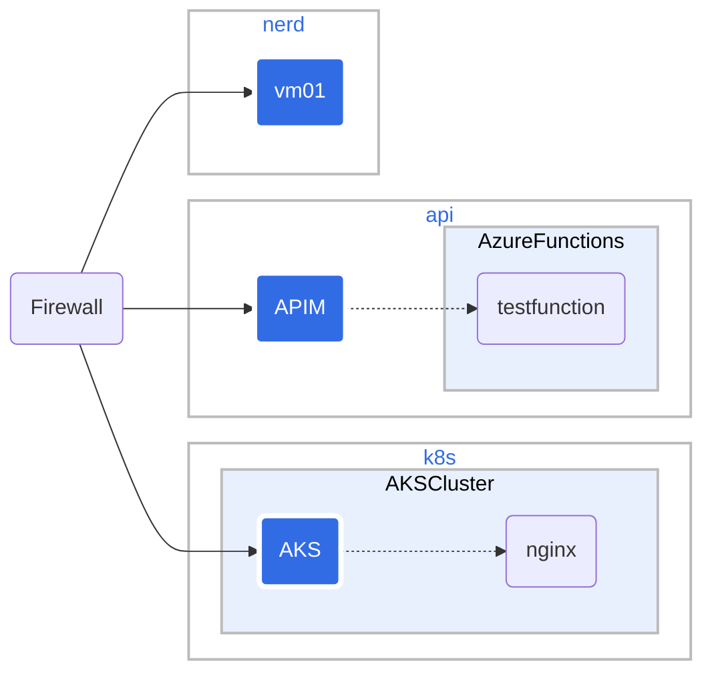

# nerdnet

The network for nerds contains landing zones defined using Microsoft Cloud Adoption Framework for Azure. The landing zones are used to test different Azure services. 

The landing zones are:

* Landing Zone: api, api for short.
* Landing Zone: nerdmeet, nerd for short.
* Landing Zone: kubernetes, k8s for short.

The landing zone api is set up for testing Azure API Management and Azure Functions.
The landing zone nerdmeet is set up for testing AI and different VMs.
The landing zone kubernetes is set up for testing kubernetes.

In front of all landing zones there is an Application Gateway. The Application Gateway terminates SSL and routes traffic based on subdomain. The Application Gateway is the only resource with a public IP address.

DNS *.christensen.no is pointing to the public IP address of the Application Gateway.

| Current state | How it was built |
|---------------|------------------|
| [nerdnet Network](9nerdnet-network.md) | [initial ChatGPT](1prompt.md) |
| [nerdnet Firewall](10nerdnet-firewall.md) | [Network & Security concepts](7concept-network-architecture-security.md) |
| [Overall Structure](0overall-structure.md) | [howto SSL](3ssl-create.md) |
| [Azure Resources](5cloud-azure.md) | [howto diagrams](8howto-diagram.md) |
| [Naming Resources using CAF](6naming-caf.md) | [howto Bicep](4bicep-setup.md) |
| . | [AZ commands and output](2commands.md) |
