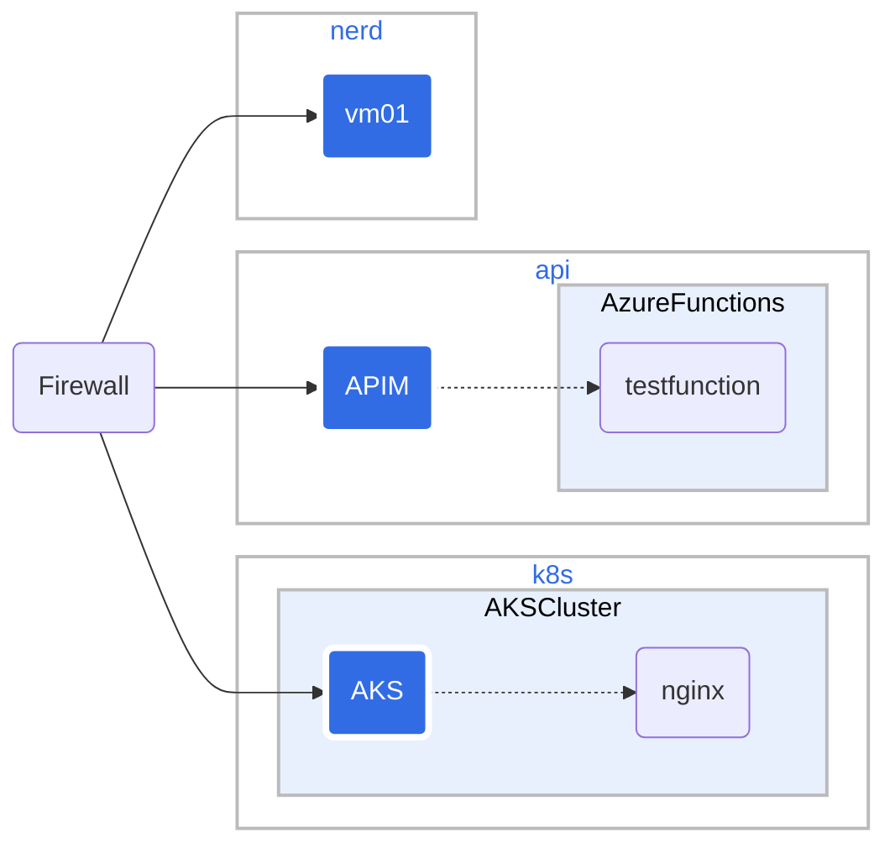

# nerdnet

The network for nerds contains landing zones defined using Microsoft Cloud Adoption Framework for Azure. The landing zones are used to test different Azure services. 

The landing zones are:

* Landing Zone: api, api for short.
* Landing Zone: nerdmeet, nerd for short.
* Landing Zone: kubernetes, k8s for short.

The landing zone api is set up for testing Azure API Management and Azure Functions.

The landing zone nerdmeet is set up for testing AI and different VMs.

The landing zone kubernetes is set up for testing kubernetes.

In front of all landing zones there is an Application Gateway. The Application Gateway terminates SSL and routes traffic based on subdomain. The Application Gateway is the only resource with a public IP address.

DNS *.christensen.no is pointing to the public IP address of the Application Gateway.

Updated nerdnet network diagram:
For details see [9nerdnet-network.md](9nerdnet-network.md).

There is a [0overall-structure.md](0overall-structure.md) that describes the overall structure of the network network and its resources.

The [2commands.md](2commands.md) contains commands used to create the network and its resources.

The [3ssl-create.md](3ssl-create.md) describes how to create a wildcard SSL certificate for the Application Gateway.

The [4bicep-setup.md](4bicep-setup.md) describes how install stuff needed for using Bicep.

The [5cloud-azure.md](5cloud-azure.md) describes the Azure resources used in the network.

The [6naming-caf.md](6naming-caf.md) describes how to name resources according to the Cloud Adoption Framework.

The [7concept-network-architecture-security.md](7concept-network-architecture-security.md) describes the conceptual network architecture and security.

The [8howto-diagram.md](8howto-diagram.md) describes how to create diagrams that is used to document the nerdnet network.

And last, but not least, [1prompt.md](1prompt.md) how to set catGPT so that it helps you to st up the system.

